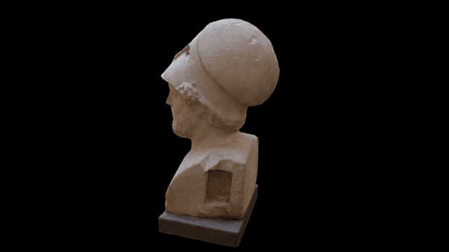

Photogrammetric model of a model of Perikles
============================================

This repository contains the files and images to create a 3D rendering of a bust of Perikles.

CONTENTS
========
* Images folder
* Masks folder
* Photoscan file
* Photoscan project files
* Models folder - .obj, .stl, .mtl, .jpg

METHODOLOGY
===========

The model was created by simply walking around the object and taking pictures with a Nikon D5100.

These were then imported into photoscan and aligned with masking.

The dense point cloud was then generated and edited for cruft. Mesh was then generated and holes closed, texture 
applied and the model exported for use on Sketchfab and wherever else. All of these processes were done at medium
settings except for the mesh creation at high.

AUTHOR
======

This was created by Daniel Pett <dpett at britishmuseum dot org> in May 2016.

LICENSE
=======

This model and associated components are copyright the Trustees of the British Museum 2016. All files held
within this repository are licensed under a Creative Commons By Attribution Share-Alike Non-Commercial license.

